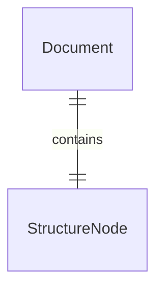

# Document

The Document domain object represents a single document in the system.
Basically the whole Encyclopedia Galactica revolves around Documents.

A Document is a piece of virtual container consists of two main attributes:

- the information itself
- metadata of the information

The information itself is the piece of knowledge we want to store.
This assumes that no metadata of the stored information is considered.
Just the pure information.
It can be an article, a sentence or any media.

The metadata of the information has the same importance as it adds extra meanings or modifies it
significantly.
Metadata can be the following:

- Original format of the document (PDF file, blog entry, physical book, etc.)
- Inner structure of the text (chapters, paragraphs, etc.)
- Category meaning it is part of any science, it is an opinion article, etc.
- References to other documents
    - Quality of the references
- History of the document
    - who modified it
    - when it was modified
    - what is the modification

All the above helps us identify the domain and value objects when it comes to Documents.

## Domain objects

### Document

| Field Name  | Description                           |
|-------------|---------------------------------------|
| Id          | The unique identifier of the Document |
| Name        | The name of the Document              |
| Description | Description of the Document           |
| Structure   | Structure tree of the Document        |

## Value objects

- StructureNode

### The complete diagram

