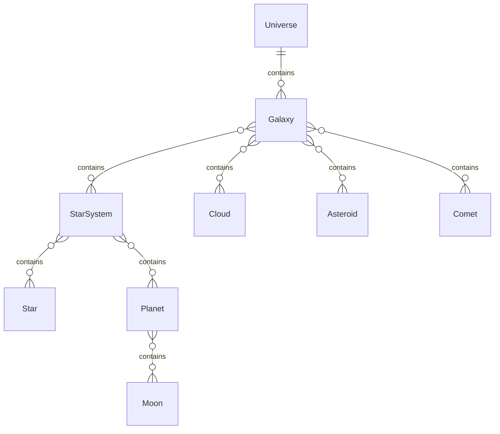

# Star Map

In this example I am going to take a look at how stellar objects can be stored in Encyclopedia 
Galactica system.
The point of the exercise is building up the structure of stellar objects.
As a consequence the full functionality of a star map is not discussed here.

A star map has the following objects:

- universe
- galaxy
- star system
- star
- planet
- moon
- cloud
- asteroid
- comet

The above means the following:

- Every stellar object type is a [Document](../domain/document.md)
- The [Relation](../domain/relation.md) connects to the Document's root StructureNode
- The Relation Quality is `contains`

