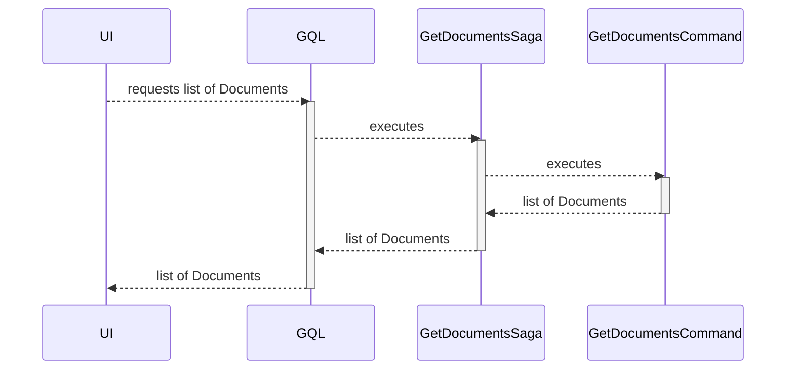

# List Document domain objects

| Parameter           | Description                     |
|---------------------|---------------------------------|
| Goal                | List Document domain objects    |
| Secondary operation | None                            |
| Input               | None                            |
| Output              | List of Document domain objects |

There are no input validation rules.

# Sequence diagram

