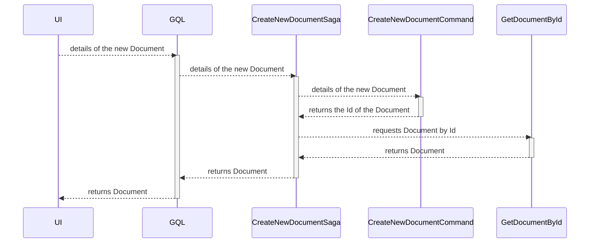

# Create a new Document domain object

| Parameter           | Description                               |
|---------------------|-------------------------------------------|
| Goal                | Create a new Document domain object       |
| Secondary operation | None                                      |
| Input               | Details of the new Document domain object |
| Output              | The new Document domain object            |

# Input validation rules

| Field       | Rule                           | Action    |
|-------------|--------------------------------|-----------|
| Id          | Must be zero                   | Exception |
| Name        | Must not be `null`             | Exception |
| Name        | Must not be `empty`            | Exception |
| Name        | Must be longer than 3 chars    | Exception |
| Name        | Must be shorter than 255 chars | Exception |
| Description | Must not be `null`             | Exception |
| Description | Must not be `empty`            | Exception |
| Description | Must be longer than 3 chars    | Exception |
| Description | Must be shorter than 255 chars | Exception |

# Sequence diagram

