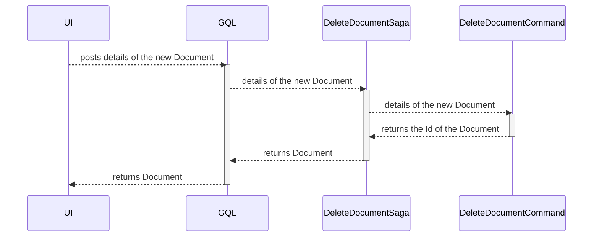

# Delete Document domain object

| Parameter           | Description                                                 |
|---------------------|-------------------------------------------------------------|
| Goal                | Delete a Document domain object                             |
| Secondary operation | Clean up all accompanied structures like StructureNode tree |
| Input               | Document Id                                                 |
| Output              | None                                                        |

# Input validation rules

| Field       | Rule                           | Action    |
|-------------|--------------------------------|-----------|
| Id          | Must not be `zero`             | Exception |

# Sequence diagram

