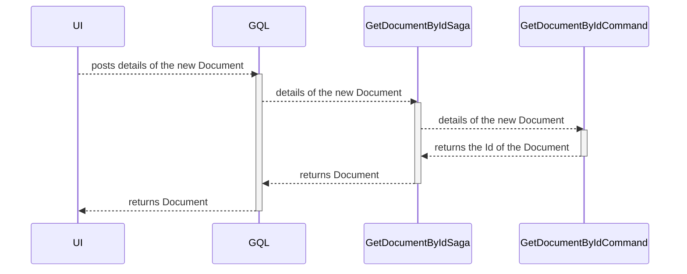

# Retrieve a Document domain object

| Parameter           | Description                       |
|---------------------|-----------------------------------|
| Goal                | Retrieve a Document domain object |
| Secondary operation | None                              |
| Input               | Document Id                       |
| Output              | None                              |

# Input validation rules

| Field       | Rule                           | Action    |
|-------------|--------------------------------|-----------|
| Id          | Must not be `zero`             | Exception |

# Sequence diagram

