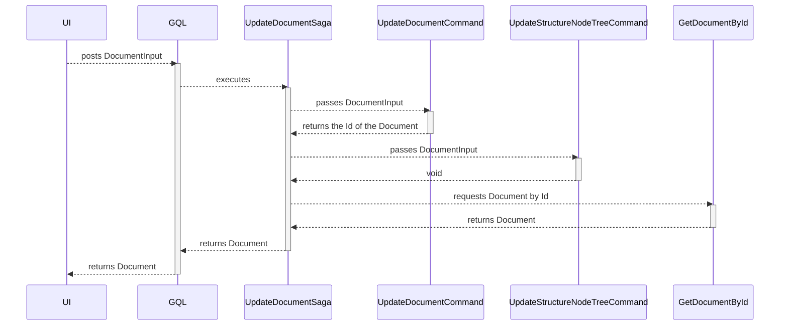

# Update a Document domain object

| Parameter           | Description                                                      |
|---------------------|------------------------------------------------------------------|
| Goal                | Update a new Document domain object                              |
| Secondary operation | Update StructureNode tree                                        |
| Input               | A DocumentInput where the properties already have the new values |
| Output              | The changed Document domain object                               |

# Input validation rules

| Field       | Rule                           | Action    |
|-------------|--------------------------------|-----------|
| Id          | Must not be `zero`             | Exception |
| Name        | Must not be `null`             | Exception |
| Name        | Must not be `empty`            | Exception |
| Name        | Must be longer than 3 chars    | Exception |
| Name        | Must be shorter than 255 chars | Exception |
| Description | Must not be `null`             | Exception |
| Description | Must not be `empty`            | Exception |
| Description | Must be longer than 3 chars    | Exception |
| Description | Must be shorter than 255 chars | Exception |

# Secondary operations

## Update the StructureNode tree

# Sequence diagram

