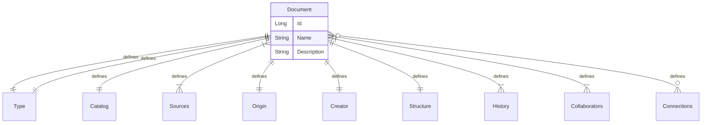

# Document entity

The document is the center of the system.
Every piece of information has a connection to a document.
The format of a document can be anything from the material to the digital, like:

- physical book
- a sheet of paper
- a file in the filesystem
- a blog entry on a site
- RSS document
- audio file

# Storing Documents

The system stores not only the content of the document, but also the structure.
Majority of the formats have their own, hopefully standardised, data format.
The system knows this and tracks the changes of these pieces.

# Changing documents

Every user of the system has the right to make changes to the documents.
It will create a new version of it.

# Examples

- a simple page where the user stores written information
- a simple page where the user store photos
- a dashboard where the user pulls together information from different sources
- audio content where the user adds or edits their stuff
- video content where the user adds or edits their stuff

# Properties of a Document

Every single document has the same set of data.
It is like Dublin Core.

| Property name | Property description                                                   |
|---------------|------------------------------------------------------------------------|
| Id            | Unique identifier                                                      |
| Name          | The name of the document                                               |
| Description   | Some description about what is the purpose of this document            |
| Type          | Type of the document                                                   |
| Catalog       | The catalog page entry                                                 |
| Sources       | List of external sources                                               |
| Origin        | The original document was used to create the one we have in the system |
| Creator       | The identity created the Document                                      |
| Structure     | A tree describing the structure of the document                        |
| History       | The history of the document consisting of the version changes          |
| Collaborators | People contributed the document                                        |
| Connections   | The connections to other Documents                                     |

